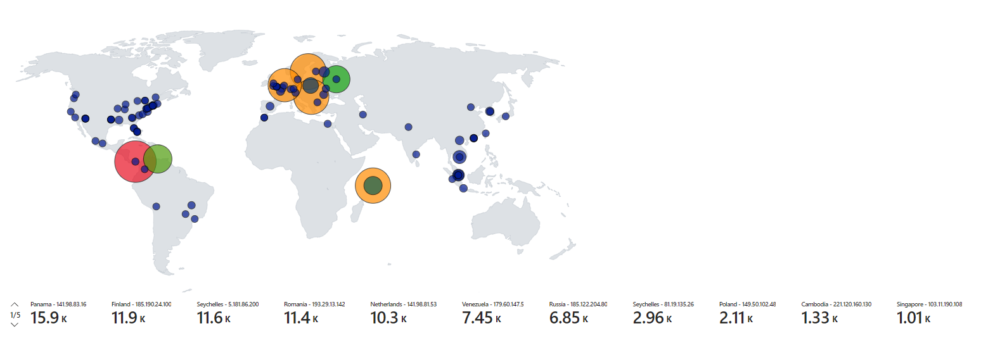

<h1>Azure Honeypot</h1>

<h2>Introduction</h2>
<h3>Overview</h3>

This project utilized the 200$ free credit when signing up with an Microsoft Azure accoutn. The lab involved deploying a windows virtual machine and turning off the firewall and allowing ICMP from the outside world. A custom powershell script was used to create a custom log that was forwarded to Microsoft Sentinel SIEM. The script used metadata from windows events ID 4625, like IP address from the attacker, and sent to a 3rd party API to get geolocation information. The custom logs were ingested by the SIEM and a geolocation attack map was created to display the attack count by Country. 

steps: 

- <b>Create windows vm, turn off firewall and enable ICMP</b>
- <b>Create and set up log analytics workspace to ingest logs, connect to VM</b>
- <b>Use ingested logs to create attack map</b>
- <b>Use powershell script to send IP address into geolocation API, to get back latitude and longitude of IP address; contributing to the custom logs</b>


<h3>Objectives</h3>

- <b> Gain hands on experience within Azure environment.</b> 
- <b> Gain experience with Microsoft Sentinel SIEM</b>
- <b></b> 
<br />


<h2>Template Skills Learned</h2>

- <b> bulleted Subheading</b> 


<h2>Template tools Used</h2>

- <b>bulleted subheading</b>

<h2>Template Steps Used</h2>

<p align="center">
Step One with image: <br/>

<br />
<br />
Step Two with image:  <br/>

<br />
<br />


### [Project Reference](https://www.youtube.com/watch?v=RoZeVbbZ0o0)


<!--
 ```diff
- text in red
+ text in green
! text in orange
# text in gray
@@ text in purple (and bold)@@
```
--!>
